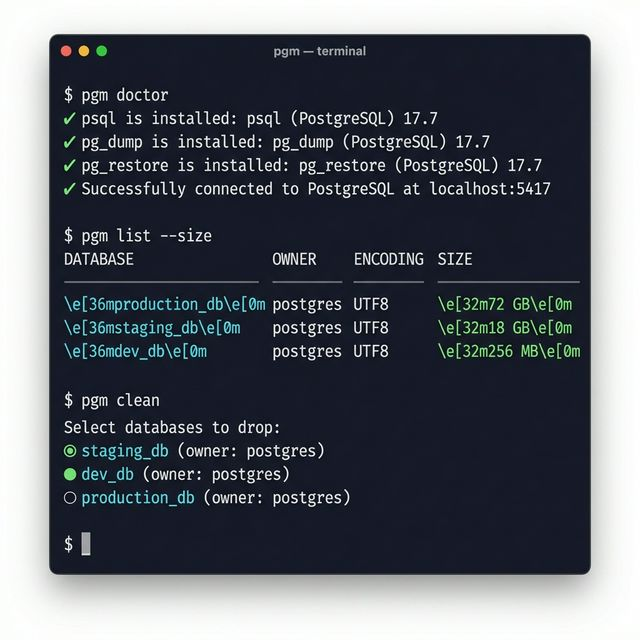

🇺🇸 English | 🇧🇷 [Português](./README.pt-BR.md)

# 🐘 pgm — PostgreSQL Manager CLI

A modern, fast, and interactive CLI designed to eliminate Developer Experience (DX) friction when managing local PostgreSQL databases, especially in environments with massive datasets, multiple server instances, and heavy daily operations.


> Designed primarily for local and development environments.

<p align="center">
  
</p>

---

## ⚡ Quick Start

```bash
npm install -g pgm
pgm doctor
pgm list
```

That's it. You're managing databases.

---

## Why pgm?

Managing PostgreSQL through raw commands is repetitive, error-prone, and painful at scale.

### ❌ Without pgm

```bash
# Backup a database
pg_dump -U postgres -h localhost -p 5416 -Fc -f ./backups/mydb_2026-02-23.dump mydb

# Then manually drop it
psql -U postgres -h localhost -p 5416 -c "DROP DATABASE mydb;"

# Restore from backup
pg_restore -U postgres -h localhost -p 5416 -d mydb --clean --if-exists ./backups/mydb_2026-02-23.dump

# Check if tools are installed
psql --version && pg_dump --version && pg_restore --version
```

### ✅ With pgm

```bash
pgm backup mydb --drop --yes        # Backup + drop in one shot
pgm restore ./backups/mydb.dump --db mydb   # Auto-detects format
pgm clean                            # Multi-select and batch-drop databases
pgm doctor                           # Full system health check
```

One command. Fewer flags. Fewer mistakes.

---

## 💡 Philosophy

pgm follows three principles:

- **Safety first** — Never drops data without explicit confirmation or a verified backup.
- **Explicit over implicit** — Connection resolution follows a strict, documented priority. No magic.
- **Developer workflow optimization** — Every command is designed to save you from repetitive terminal work.

---

## 🔒 Safety

`pgm` handles destructive operations with care:

- **Never drops a database** unless explicit confirmation is given
- **Aborts the entire operation** if a safety backup fails during `pgm clean`
- **Validates `pg_dump` exit codes** before considering a backup successful
- **Requires `--drop` flag** intentionally — dropping is never the default
- **`--yes` must be combined with `--drop`** — cannot skip confirmation alone

> If you request a backup before dropping and that backup fails, pgm stops immediately. No data is lost.

---

## 🚀 Key Features

- **📋 Smart Listing** — Optimized listing strategy for massive clusters. Optional `--size` flag for disk usage analysis, sorted largest-first.
- **💾 Intelligent Backup & Restore** — Supports Custom (`.dump`) and Plain (`.sql`) formats. Auto-detects the right tool for restores.
- **🧹 Bulk Cleanup** — Multi-select databases, optionally backup, and batch-drop them. Reclaim disk space instantly.
- **🩺 System Diagnostics** — One-command health check verifying binaries, authentication, and connectivity.
- **⚙️ Persistent Profiles** — Save named server configurations. Switch between environments with `-s pg16`.
- **🎯 Smart Connection Resolution** — Explicit CLI flags → profiles → saved defaults → auto-discovery. Always predictable.

---

## 🧩 Requirements

- **Node.js** 18 or higher
- **PostgreSQL client tools** (`psql`, `pg_dump`, `pg_restore`) installed and available in your `PATH`

> [!TIP]
> Run `pgm doctor` after installation to verify everything is set up correctly.

---

## 📦 Installation

**npm (recommended):**

```bash
npm install -g pgm
```

**From source:**

```bash
git clone https://github.com/your-user/cli-pgm.git
cd cli-pgm
npm install
npm run build
npm link
```

---

## 🛠️ Commands

### `pgm version`

Shows the CLI version and the connected PostgreSQL server version.

```bash
pgm version
```

### `pgm doctor`

Runs a full system health check:

- Verifies `psql`, `pg_dump`, and `pg_restore` are installed and reachable
- Attempts a live connection using the resolved configuration
- Tests authentication against the target server

```bash
pgm doctor
```

---

### 📋 `pgm list`

Lists all databases on the connected server.

```bash
pgm list              # Fast listing (name, owner, encoding)
pgm ls --size         # Includes disk size, sorted largest → smallest
```

> [!NOTE]
> The `--size` flag calculates physical disk usage via `pg_database_size()`. On servers with dozens of multi-GB databases, this may take a few minutes depending on disk speed.

---

### `pgm create <name>`

Creates a new database.

```bash
pgm create my_new_db
```

### `pgm drop <name>`

Drops a database with interactive confirmation.

```bash
pgm drop my_old_db
```

---

### 🧹 `pgm clean` — Bulk Cleanup

Working with seed-heavy development databases? Need to reclaim disk space fast?

`pgm clean` allows you to:

- **Multi-select** databases from an interactive checkbox UI
- **Optionally generate safety backups** before any destructive action
- **Batch-drop** all selected databases safely
- **Abort immediately** if any backup fails, preventing data loss

```bash
pgm clean
```

This is designed for the real-world dev workflow: clone databases, experiment, then clean up everything in one shot.

---

### 📦 `pgm backup <database>`

Generates a timestamped backup in `./backups/`.

```bash
pgm backup mydb                       # Custom format (.dump)
pgm backup mydb --format plain        # Plain SQL (.sql)
pgm backup mydb --drop                # Backup, then ask to drop
pgm backup mydb --drop --yes          # Backup + drop, no questions
pgm backup mydb -o ./my-backups       # Custom output directory
```

| Option | Description |
|---|---|
| `-F, --format <type>` | `custom` (default, compressed) or `plain` (raw SQL) |
| `-d, --drop` | Prompt to drop database after successful backup |
| `-y, --yes` | Skip drop confirmation (requires `--drop`) |
| `-o, --output <dir>` | Output directory (default: `./backups`) |

---

### 📥 `pgm restore <file>`

Restores a database from a backup file. Automatically detects the format:

- `.sql` → uses `psql -f`
- `.dump` or any other extension → uses `pg_restore`

```bash
pgm restore ./backups/mydb_2026-02-23.dump --db mydb
pgm restore ./exports/data.sql --db mydb
```

Need to override auto-detection? Use `--format`:

```bash
pgm restore archive.bkp --db mydb --format custom
pgm restore script.txt --db mydb --format plain
```

---

## ⚙️ Configuration & Server Profiles

`pgm` stores configuration locally at `~/.pgm/config.json`.

### Set Global Defaults

```bash
pgm config set user postgres
pgm config set password my_secret
pgm config set port 5432
```

### Named Server Profiles

Manage multiple PostgreSQL instances effortlessly:

```bash
pgm config add pg16 --port 5416
pgm config add pg17 --port 5417 --user admin
pgm config add staging --host 192.168.0.10 --port 5432
```

Then connect using the `-s` flag:

```bash
pgm list -s pg16
pgm backup mydb -s staging
```

### View & Manage Config

```bash
pgm config list           # Show all saved settings and profiles
pgm config get port       # Get a specific value
pgm config rm pg16        # Remove a server profile
pgm config reset          # Clear all configuration
```

---

## 🔌 Connection Priority

When resolving how to connect, `pgm` follows a strict, predictable priority order:

| Priority | Source | Example |
|---|---|---|
| 1️⃣ | **CLI flags** | `pgm list --port 5417` |
| 2️⃣ | **Server profile** | `pgm list -s pg16` |
| 3️⃣ | **Saved defaults** | `pgm config set port 5432` |
| 4️⃣ | **Auto-discovery** | Scans common ports; prompts if multiple found |

This means explicit input always wins. No surprises.

---

## 🤔 Why not pgAdmin?

pgAdmin is a powerful GUI tool for database administration. `pgm` is not a replacement for it.

`pgm` is optimized for **terminal-first developer workflows** — quick operations, scripting, CI pipelines, and managing multiple local instances without leaving the terminal.

No GUI. No overhead. Just speed.

---

## 🐳 Docker Support (Coming Soon)

`pgm` will be able to detect and interact with PostgreSQL instances running inside Docker containers — listing, connecting, and managing them as naturally as local instances.

---

## 🗺 Roadmap

- [x] Backup & restore
- [x] Profiles
- [x] Doctor
- [ ] Docker integration
- [ ] Encrypted backups
- [ ] TTL cleanup
- [ ] Windows binary build

---

## 🤝 Contributing

PRs are welcome! Please open an issue first to discuss major changes.

```bash
git clone https://github.com/your-user/cli-pgm.git
cd cli-pgm
npm install
npm run dev
```

---

## 📄 License

MIT
